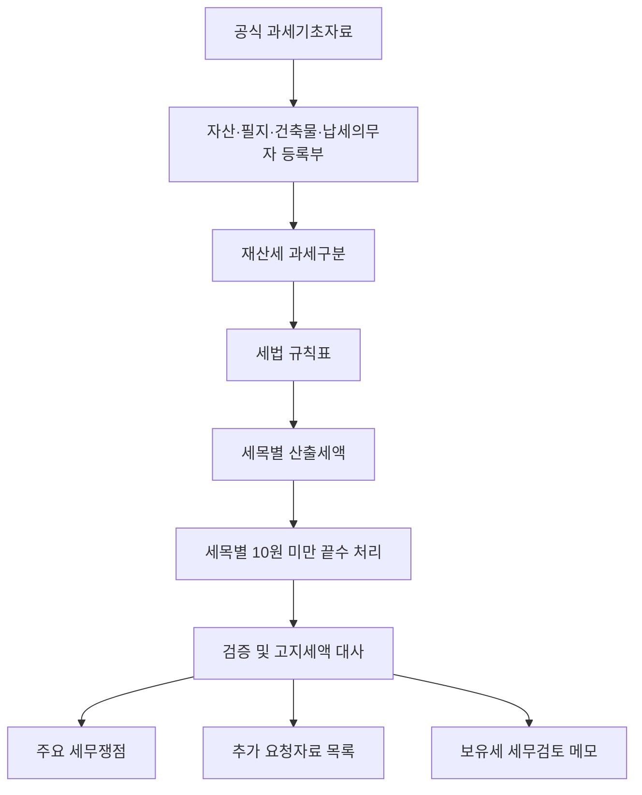

# 시스템 구조

## 공개 런타임

`app.py`는 General, Assurance, Tax와 Methodology 네 화면을 연결합니다. Deals와 KRX 관련 모듈은 공개 시작 경로에 포함하지 않습니다. API 인증정보는 서버 측에서만 읽고 화면·로그·내려받기 자료에 전달하지 않습니다.

## v15 Tax 모듈

```text
src/tax_v15/
  loaders.py       CSV 계약 검증과 Decimal 로딩
  schemas.py       파일별 필수 컬럼
  rules.py         세법 규칙표 조회와 검증 게이트
  calculators/     토지·건축물·부가세목·끝수 처리
  validation/      자료 확인범위와 Fail-closed 통제
  reporting/       추가 요청자료, 메모, CSV·Excel·HTML 생성
```



## 계산 계약

`tax_calculation_detail.csv`는 끝수 처리 전 산출세액, 처리 단위·방법·법적 근거, 처리 후 재계산액과 차이를 보존합니다. `calculated_tax`는 처리 후 금액과 같으며, 비과세·과세대상 제외·시가표준액 행에는 끝수 처리 정보를 기록하지 않습니다.

## 통제 경계

- 필수 공식자료가 없으면 계산하지 않습니다.
- 실제 고지서 확인 전에는 `verified_notice`를 생성하지 않습니다.
- 민감도 분석은 같은 계산 엔진을 다시 호출합니다.
- UI·메모·내려받기 자료는 동일한 처리 후 합계를 사용합니다.
- 건축물 장부가액이나 Peer 비율을 공식 과세기초가액의 대체값으로 사용하지 않습니다.
