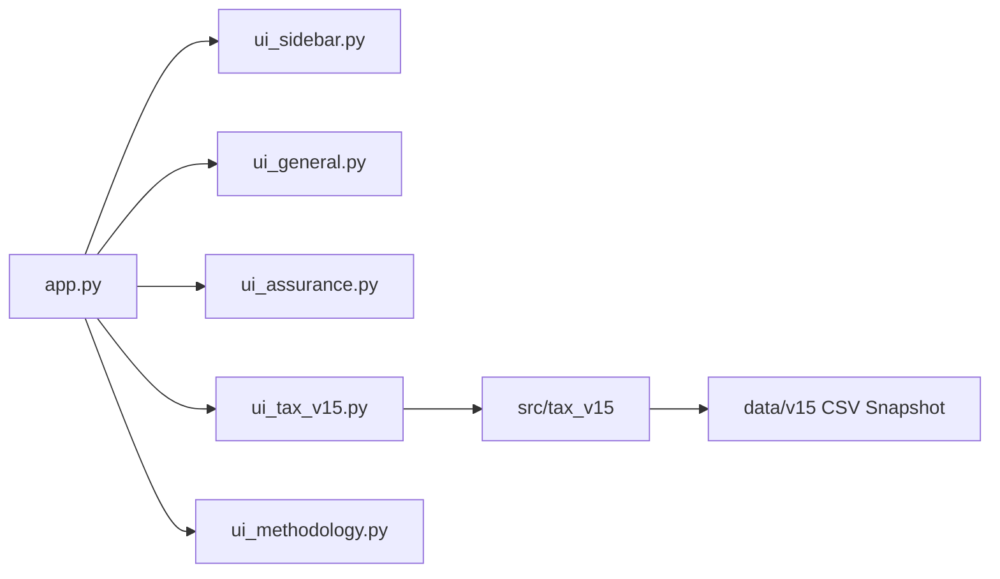
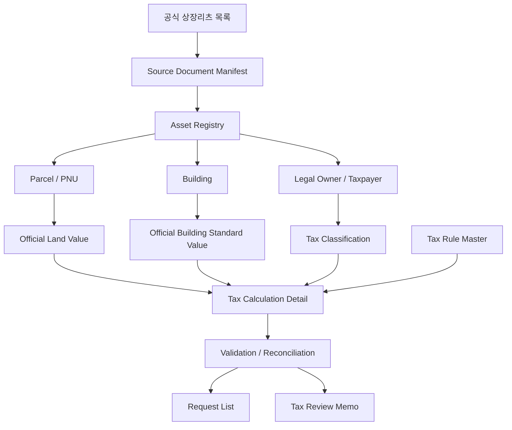

# Architecture

## Runtime

`app.py`는 Streamlit 진입점이며 General, Assurance, Tax, Methodology 네 모드를 오케스트레이션합니다. Deals와 KRX API는 공개 시작 경로에 포함되지 않습니다.



## v15 Tax 계층

```text
src/tax_v15/
  acquisition/    공식 홈페이지·PDF 링크와 페이지 근거 추출
  calculators/    토지·건축물·부가세목·종부세 계산
  reporting/      Request List, Memo, CSV·Excel·HTML Export
  validation/     Source·Schema·Coverage·계산상태 통제
  loaders.py      고정 스키마 CSV 로더
  models.py       Decimal 계산결과와 Fail-closed 상태
  rules.py        Tax Rule Master 조회와 누진세율 계산
  taxpayer.py     신탁 납세의무자와 분리과세 판정
```

## 데이터 흐름



## 경계

- General·Assurance의 Peer·재무 Snapshot은 v15 Tax 계산과 분리합니다.
- 인증값은 `api_manager.py`에서 서버 측으로 로드하고 UI와 출력에 전달하지 않습니다.
- 원문 PDF와 OCR 산출물은 로컬 캐시에 두고 Git에는 정규화된 사실과 Source metadata만 저장합니다.
- `TaxRuleBook`은 공식 검증 상태와 공식 URL이 없는 규칙을 거부합니다.
- 미검증 상태에는 `calculated_tax`를 저장할 수 없습니다.

## 재현 경로

```powershell
py -m scripts.v15.run_pipeline --tax-year 2026 --all-reits --no-resume
py -m pytest -q
py -m streamlit run app.py
```
